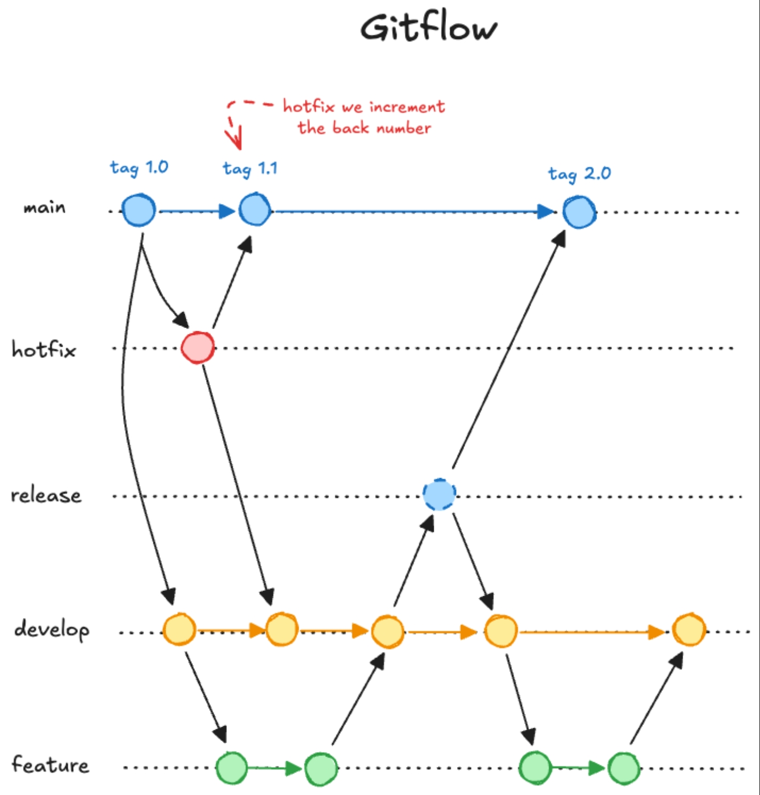
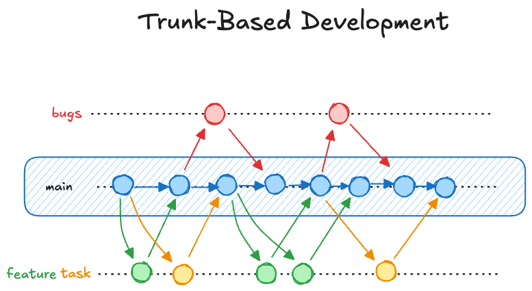

# 🧠 **EcommerceCoZam** – Estrategias de Branching

Este documento describe y justifica las estrategias de control de versiones adoptadas en el proyecto **EcommerceCoZam**, diferenciando las prácticas utilizadas por los equipos de **Desarrollo** e **Infraestructura**, alineadas con los principios de colaboración eficiente, integración continua y despliegue escalable de microservicios.

## 📌 Contexto General del Proyecto

- **Modelo de trabajo**: Dos equipos especializados trabajando en colaboración continua.
- **Cultura DevOps**: Automatización completa de testing, builds, deployments y monitoreo.
- **Objetivo principal**: Desarrollo y despliegue de una plataforma de e-commerce basada en microservicios.
- **Estrategia de despliegue**: CI/CD automatizado con múltiples entornos (dev, staging, prod) y releases controlados.

## 👨‍💻 Equipo de Desarrollo: Git Flow



### ✅ Estrategia Adoptada

El equipo de desarrollo utiliza **Git Flow**, una estrategia robusta que soporta el desarrollo paralelo de funcionalidades y releases controlados. El flujo incluye:

1. **Rama principal (`main`)** - Código en producción, siempre estable y desplegable.
2. **Rama de desarrollo (`develop`)** - Integración continua de nuevas funcionalidades.
3. **Ramas de release (`release/*`)** - Preparación de versiones para producción.
4. **Ramas de características (`feature/*`)** - Desarrollo de funcionalidades individuales.
5. **Ramas de hotfix (`hotfix/*`)** - Correcciones urgentes en producción.

#### Convenciones de Nombrado

```
📁 Estructura de Ramas:
├── main                     # Producción estable
├── develop                  # Integración de desarrollo
├── release/v1.2.0           # Preparación de release
├── feature/user-auth        # Nueva funcionalidad
├── feature/payment-gateway  # Sistema de pagos
├── feature/order-tracking   # Seguimiento de pedidos
└── hotfix/critical-bug      # Corrección urgente
```

### 🤔 Justificación para Git Flow

| Factor                   | Git Flow – Ventajas clave                                                                |
| ------------------------ | ---------------------------------------------------------------------------------------- |
| 🏗️ Arquitectura compleja | Ideal para microservicios con múltiples dependencias y componentes interrelacionados.    |
| 📦 Releases programados  | Soporte nativo para ciclos de release planificados con testing exhaustivo.               |
| 🚨 Hotfixes críticos     | Rama dedicada para correcciones urgentes sin afectar el desarrollo en curso.             |
| 🔄 Desarrollo paralelo   | Múltiples features pueden desarrollarse simultáneamente sin interferencias.              |
| 🧪 Testing comprehensive | Separation clara entre desarrollo, testing de integración y preparación para producción. |
| 📋 Gestión de versiones  | Control granular de versiones con semantic versioning (SemVer).                          |

## ⚙️ Equipo de Infraestructura: Trunk-Based Development



### ✅ Estrategia Adoptada

El equipo de infraestructura utiliza **Trunk-Based Development**, una estrategia ágil que promueve integración continua con la rama principal, complementada con ramas de feature cortas para cambios complejos.

1. **Rama principal (`main`)** - Código de infraestructura siempre funcional y desplegable.
2. **Ramas de feature cortas (`feature/*`)** - Solo para cambios complejos que requieren múltiples commits.
3. **Pull Requests obligatorios** - Toda modificación debe ser revisada antes del merge.
4. **Feature flags** - Para cambios que requieren activación gradual.

#### Convenciones de Nombrado

```
📁 Estructura de Ramas:
├── main                          # Infraestructura en producción
├── feature/k8s-cluster-upgrade   # Actualización de Kubernetes
├── feature/monitoring-stack      # Stack de monitoreo
├── feature/security-policies     # Políticas de seguridad
└── feature/backup-automation     # Automatización de backups
```

### 🤔 Justificación para Trunk-Based Development

| Factor                          | Trunk-Based – Ventajas clave                                                    |
| ------------------------------- | ------------------------------------------------------------------------------- |
| ⚡ Cambios de infraestructura   | Aplicación rápida de configuraciones críticas y parches de seguridad.           |
| 🔧 Infrastructure as Code (IaC) | Terraform y Kubernetes manifests se benefician de integración continua.         |
| 📉 Complejidad reducida         | Evita merge conflicts complejos en archivos de configuración.                   |
| 🚀 Despliegues automatizados    | Compatible con GitOps y pipelines de infraestructura automatizados.             |
| 🔍 Auditabilidad                | Historial lineal facilita auditorías de cambios en infraestructura.             |
| 🤝 Coordinación simplificada    | Reducción de overhead en coordinación para cambios de infraestructura críticos. |

## ⚖️ Comparación entre Estrategias

| Criterio                     | Git Flow (Desarrollo)       | Trunk-Based (Infraestructura) |
| ---------------------------- | --------------------------- | ----------------------------- |
| **Complejidad de branching** | Alta (5 tipos de ramas)     | Baja (main + features cortas) |
| **Tiempo de integración**    | Medio (via develop/release) | Muy rápido (directo a main)   |
| **Gestión de releases**      | Estructurada y planificada  | Continua y automática         |
| **Hotfixes**                 | Rama dedicada               | Directo a main con PR         |
| **Paralelización**           | Alta (múltiples features)   | Media (features cortas)       |
| **Riesgo de conflictos**     | Medio (resuelto en develop) | Bajo (integración continua)   |
| **Auditabilidad**            | Alta (tags y releases)      | Muy alta (historial lineal)   |

## 🔄 Coordinación entre Equipos

### Dependencias y Sincronización

#### Desarrollo → Infraestructura

- **Nuevos servicios**: Requieren configuración de deployment, service discovery, monitoring
- **Cambios de recursos**: CPU, memoria, storage requirements
- **Variables de entorno**: Secrets, configuraciones específicas por entorno

#### Infraestructura → Desarrollo

- **Updates de plataforma**: Nuevas versiones de Kubernetes, bases de datos
- **Políticas de seguridad**: Cambios en networking, RBAC, service mesh
- **Monitoreo**: Nuevas métricas disponibles, dashboards, alertas

### Proceso de Coordinación


## 🛡️ Políticas de Protección

### Rama Main (Ambos Equipos)

- ✅ **Pull Request obligatorio**
- ✅ **Mínimo 1 reviewer aprobación**
- ✅ **CI/CD tests passed**
- ✅ **No direct pushes allowed**
- ✅ **Branch up-to-date requirement**

### Rama Develop (Solo Desarrollo)

- ✅ **Pull Request obligatorio**
- ✅ **Automated testing passed**
- ✅ **Code coverage > 80%**
- ✅ **Security scan passed**

### Release Branches (Solo Desarrollo)

- ✅ **Restricted to release manager**
- ✅ **Full test suite execution**
- ✅ **Performance testing passed**
- ✅ **Security audit completed**

## 📊 Métricas y Monitoreo

### Métricas de Desarrollo (Git Flow)

- **Feature lead time**: Tiempo desde feature start hasta merge en develop
- **Release cycle time**: Tiempo desde release branch hasta production
- **Hotfix frequency**: Número de hotfixes por release
- **Code review time**: Tiempo promedio de review de PRs

### Métricas de Infraestructura (Trunk-Based)

- **Change lead time**: Tiempo desde commit hasta deploy en producción
- **Deployment frequency**: Número de deployments por día/semana
- **Mean time to recovery (MTTR)**: Tiempo de recuperación ante fallos
- **Change failure rate**: Porcentaje de deployments que requieren rollback

## 📌 Conclusión

Las estrategias seleccionadas se complementan perfectamente para el proyecto **EcommerceCoZam**:

### Git Flow para Desarrollo

- ✅ **Estabilidad** para arquitectura de microservicios compleja
- ✅ **Control de calidad** con múltiples puntos de validación
- ✅ **Flexibilidad** para desarrollo paralelo de múltiples features
- ✅ **Gestión de releases** estructurada y predecible

### Trunk-Based para Infraestructura

- ⚡ **Agilidad** para cambios críticos de infraestructura
- 🔍 **Transparencia** con historial lineal y auditable
- 🚀 **Automatización** compatible con GitOps y IaC
- 🛡️ **Seguridad** con reviews obligatorios y validación continua

Esta combinación de estrategias refuerza la **cultura DevOps**, facilita la **coordinación entre equipos** y asegura tanto la **estabilidad del producto** como la **agilidad operacional** necesarias para una plataforma de e-commerce de clase empresarial.
